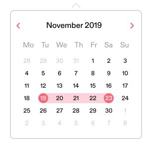

# ArtConnect Front End Test

## Story

ArtConnect makes the life of Creatives easier by helping them to find local events and opportunities. To help them find exactly what they are looking for, we provide many filters that allow them to customize the results that they are seeeing.

## Task

Write a component that displays a calendar that allow the creatives to select a date range.

## Acceptance criteria

* It should be possible to select a single date (the user is able to click outside after the first date is selected and close the filter)
* After selecting the first date, it should be recognizable that second date can be selected (the background between the first date and the date that the cursor is hovering is highlighted).

## Design

**Questions: (Answer them together with your test in a file called `ANSWERS.md`)**
- If applicable, what was your motivation on choosing the framework?
- What was your code design process and what was your motivation on the choice of patterns.
- What was the process of packaging your code for delivery?
- What would you change on this test to improve the developer experience?

## Further instructions
* Create a **PRIVATE** repository on Github to submit your code. They are **FREE**.
* When you finish the challenge, invite `fabiocarneiro`  as a collaborator to the repository you created and **send a notification e-mail** to `fabio@artwhere.io`.
* Feel free to use any libraries that can be installed from a package manager, but not the whole component.
* **Consider that you are developing a production-ready component and it is going to be used for the next five years. Choose your solutions with that in mind.**
* Your component needs to run with as much simplicity as possible. Single line commands or by opening a single file (please provide running instructions).
* Given the results fit our minimum acceptance criteria, we will schedule a call, and this test will be one of the subjects of the conversation.
* We aim to provide you feedback within seven days. Please try to submit your answer within 3 to 4 working days. If you are unable to provide the results within the given timeline, please let us know.
* Please contact us for any questions you might have during the process.

## Evaluation criteria
* Your modeling skills. Is it possible to understand the problem from the code?
* You follow best practices appropriate to your language/framework of choice
* Code is organized, clean and readable.
* Code is maintainable. (It's up to you to know how to produce maintainable code)
